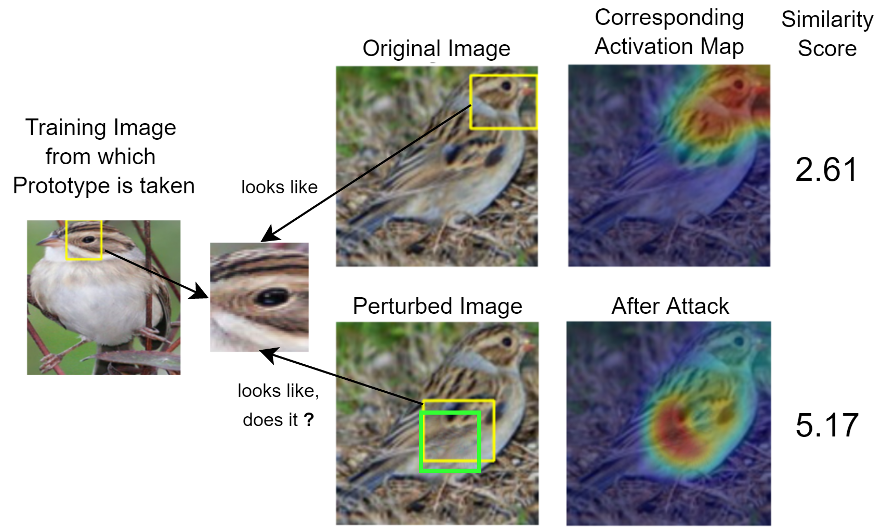
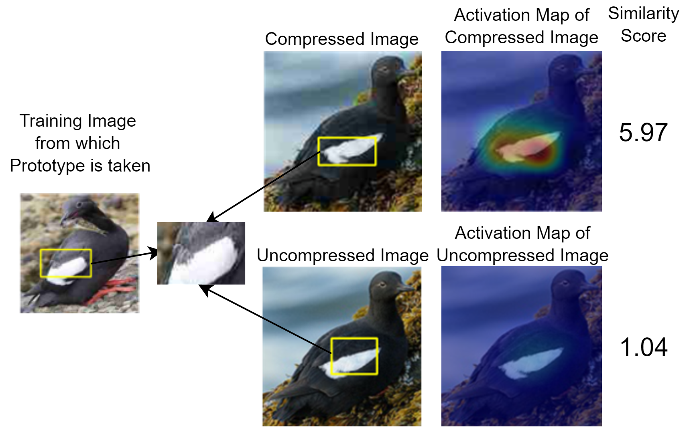

# This Looks Like That... Does it? Shortcomings of Latent Space Prototype Interpretability in Deep Networks

This repository contains code for reproducing experiments and models from the paper "[This Looks Like That... Does it? Shortcomings of Latent Space Prototype Interpretability in Deep Networks](https://arxiv.org/abs/2105.02968)" by Adrian Hoffmann\*, Claudio Fanconi\*, Rahul Rade\* and Jonas Kohler. 

A short version of the paper has been accepted at the [ICML 2021 Workshop on Theoretic Foundation, Criticism, and Application Trend of Explainable AI](https://icml2021-xai.github.io/).


Head-On-Stomach Experiment            | JPEG Experiment
:-------------------------:|:-------------------------:
 | 

## Setup

### Installation

Clone this repository.
```bash
$ git clone https://gitlab.ethz.ch/fanconic/this-does-not-look-like-that
$ cd this-does-not-look-like-that
```

We suggest to create a virtual environment and install the required packages.
```bash
$ conda create --name experiment_env
$ conda activate experiment_env
$ conda install --file requirements.txt
```

### Dataset

Download the CUB-200-2011 dataset from http://www.vision.caltech.edu/visipedia/CUB-200-2011.html and extract the files in a suitable folder.

### Repository Structure

- `run_training.sh`: Train ProtoPNet on CUB-200-2011 dataset.
- `run_jpeg_training.sh`: Train ProtoPNet on altered CUB-200-2011 dataset.
- `local_analysis_attack1.ipynb`: Head-On-Stomach Experiment.
- `JPEG_experiment_analysis`: JPEG Experiment.
- `local_analysis_attack3.ipynb`: Attack 2 (Make head disappear).
- `adv_training_attack1.ipynb`: Head-On-Stomach Experiment Success Rate.
- `run_fgsm_training.sh `: Remedy for Head-On-Stomach Experiment (Train ProtoPNet on CUB-200-2011 dataset via fast FGSM training).
- `run_jpeg_shuffled.sh `: Remedy for JPEG Experiment (Train ProtoPNet on CUB-200-2011 dataset with JPEG augmentation).

### Source Code Directory Tree
```
.
└── src                 # Source code for the experiments
    ├── data                # Data setup, preprocessing, augmentation 
    ├── models              # ProtoPNet and various features of it
    ├── training            # Training and test scripts
    └── utils               # Helpers, visualization and local analysis
```

## Training ProtoPNets

Please set the variable `base_architecture` in [`settings.py`](settings.py) to the backbone which you want to use for the ProtoPNet. Also, set the path to the downloaded dataset in [`src/data/setup.py`](src/data/setup.py).

Training ProtoPNets used in the Head-On-Stomach experiment.
```bash
$ ./run_training.sh
```

Training ProtoPNets used in the JPEG experiment.
```bash
$ ./run_jpeg_training.sh
```

## Reproducing Results of Our Experiments

To recreate the results of the experiments, you can use the provided Jupyter Notebooks.

Download the pretrained model weights of both experiments from here:
https://polybox.ethz.ch/index.php/s/9IuQipiluxPMg1z?path=%2FPPNet

Finally, follow the instructions in the provided notebooks to reproduce our experiments.
- [`local_analysis_attack1.ipynb`](local_analysis_attack1.ipynb): Head-On-Stomach Experiment.
- [`JPEG_experiment_analysis.ipynb`](JPEG_experiment_analysis.ipynb): JPEG Experiment.


## Contributors
- Adrian Hoffmann - adriahof@ethz.ch
- Claudio Fanconi - fanconic@ethz.ch
- Rahul Rade - rarade@ethz.ch


## Reference

```
@misc{hoffmann2021looks,
    title={This Looks Like That... Does it? Shortcomings of Latent Space Prototype Interpretability in Deep Networks}, 
    author={Adrian Hoffmann and Claudio Fanconi and Rahul Rade and Jonas Kohler},
    year={2021},
    booktitle={ICML 2021 Workshop on Theoretic Foundation, Criticism, and Application Trend of Explainable AI},
}
```

## Acknowledgement

This code is partly borrowed from [cfchen-duke/ProtoPNet](https://github.com/cfchen-duke/ProtoPNet). We would like to thank the authors of [ProtoPNet](https://arxiv.org/abs/1806.10574) for making their code openly available.
